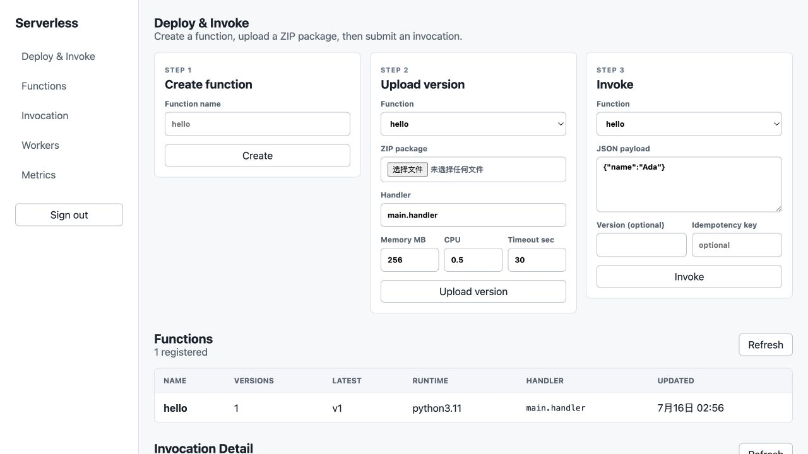
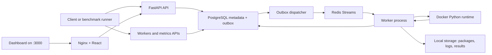

# Serverless Cloud Platform

[](https://github.com/KiriSchrieffer/serverless-cloud-platform/actions/workflows/ci.yml)
[](https://github.com/KiriSchrieffer/serverless-cloud-platform/releases/tag/v1.0.0)
[](https://www.python.org/)
[](docker-compose.yml)

A Lambda-inspired, local-first serverless execution platform built to
demonstrate control-plane, queueing, worker-recovery, and container-runtime
engineering. FastAPI and PostgreSQL accept durable invocations, Redis Streams
dispatches them to concurrent workers, Docker isolates Python handlers, and an
authenticated React dashboard exposes the complete workflow.

[Architecture](#architecture) · [Quick Start](#local-quick-start) ·
[Release Benchmark](#release-benchmark) ·
[v1.0.0](https://github.com/KiriSchrieffer/serverless-cloud-platform/releases/tag/v1.0.0) ·
[Design Notes](docs/design.md) · [Threat Model](docs/threat-model.md)

> **Audited release evidence:** 750 cold-container invocations across nine
> benchmark runs completed with a **100% success rate** through the complete
> API → PostgreSQL outbox → Redis Streams → worker → Docker runtime path.
> [Read the generated benchmark report](docs/benchmark-release-report.md).



<p align="center"><em>Authenticated dashboard for deployment, invocation, logs, worker health, and platform metrics.</em></p>

## Engineering Highlights

| Area | Implementation |
| --- | --- |
| Durable dispatch | PostgreSQL transactional outbox commits invocation state and dispatch intent atomically before publishing to Redis Streams. |
| Recovery and retries | Consumer-aware stale-work reclaim, delivery deduplication, bounded retries, exponential backoff with jitter, and one end-to-end deadline. |
| Isolated execution | Immutable, hashed function versions run in per-invocation Python 3.11 containers with CPU, memory, timeout, and output limits. |
| Concurrency correctness | Bounded worker concurrency, idempotency constraints, atomic Redis token-bucket rate limiting, and race-tested PostgreSQL/Redis paths. |
| Security and ownership | Bcrypt password hashing, signed JWT authentication, owner-scoped resources, package validation, and an explicit threat model. |
| Observability and UX | Worker heartbeats, queue/retry/error/latency metrics, persisted logs and results, plus an authenticated React operations dashboard. |

## Architecture



The platform is intentionally local-first. It is useful for demonstrating
serverless control-plane and worker-runtime concepts, not for production-grade
multi-tenant isolation.

## Repository Layout

```text
backend/       FastAPI gateway, schemas, services, database migrations
worker/        Worker loop, heartbeats, Redis consumer, recovery, Docker execution
runtime/       In-container Python runtime runner and runtime image
frontend/      React and TypeScript monitoring dashboard
infra/         Local infrastructure notes
scripts/       Demo and developer helper scripts
tests/         Unit and failure-injection tests
benchmarks/    Benchmark runner and workload functions
examples/      Example user functions
storage/       Local package, result, and log storage
docs/          Design notes, threat model, benchmark report
```

## Local Quick Start

Requirements:

- Docker Desktop or Docker Engine
- Python 3.11+
- Bash and curl

Start the full local platform:

```bash
git clone https://github.com/KiriSchrieffer/serverless-cloud-platform.git
cd serverless-cloud-platform

docker compose up --build
```

This starts:

- PostgreSQL
- Redis
- a one-shot Alembic database migration
- the Python 3.11 runtime image build
- FastAPI API on `http://localhost:8000`
- React Dashboard on `http://localhost:3000`
- transactional outbox dispatcher
- Worker process connected to Redis Streams

The compose setup uses `.env.example` for local defaults. PostgreSQL and Redis
must pass their health checks, and the migration must complete, before the API
and worker start. The Dashboard waits for the API health check and proxies
browser requests from `/api` to FastAPI, so no separate frontend command is
required for the full Compose stack.

Open `http://localhost:3000`, register a local account, then use the three-step
Deploy & Invoke panel to create a function, upload its ZIP package, and invoke
it. Accepted invocations automatically open in the detail panel for refresh,
result, error, and log inspection.

## Run the Demo Invocation

In a second terminal, run this from the repository root:

```bash
bash scripts/demo_invoke.sh
```

The script will:

- create a sample function
- build a `function.zip`
- upload a new version
- invoke the function
- poll until terminal status
- print the invocation response and logs

Expected terminal state is `SUCCEEDED`, with a result similar to:

```json
{"message":"hello Ada"}
```

## Useful API Calls

Register and obtain a local access token:

```bash
curl -fsS -X POST http://localhost:8000/auth/register -H "Content-Type: application/json" -d '{"email":"demo@example.local","password":"local-demo-password"}'
```

```bash
export ACCESS_TOKEN="$(curl -fsS -X POST http://localhost:8000/auth/login -H "Content-Type: application/json" -d '{"email":"demo@example.local","password":"local-demo-password"}' | python3 -c 'import json,sys; print(json.load(sys.stdin)["access_token"])')"
```

Create a function:

```bash
curl -fsS -X POST http://localhost:8000/functions \
  -H "Authorization: Bearer $ACCESS_TOKEN" \
  -H "Content-Type: application/json" \
  -d '{"name":"hello"}'
```

Invoke a function:

```bash
curl -fsS -X POST http://localhost:8000/functions/hello/invoke \
  -H "Authorization: Bearer $ACCESS_TOKEN" \
  -H "Content-Type: application/json" \
  -d '{"payload":{"name":"Ada"},"idempotency_key":"demo-hello"}'
```

Query an invocation:

```bash
curl -fsS -H "Authorization: Bearer $ACCESS_TOKEN" http://localhost:8000/invocations/<invocation_id>
```

Query invocation logs:

```bash
curl -fsS -H "Authorization: Bearer $ACCESS_TOKEN" http://localhost:8000/invocations/<invocation_id>/logs
```

Query workers and metrics:

```bash
curl -fsS -H "Authorization: Bearer $ACCESS_TOKEN" http://localhost:8000/workers
curl -fsS -H "Authorization: Bearer $ACCESS_TOKEN" http://localhost:8000/metrics/summary
```

## Release Benchmark

Run a real local benchmark after `docker compose up --build` is running:

```bash
python3 benchmarks/run_benchmark.py \
  --workload noop \
  --invocations 100 \
  --concurrency 10
```

The benchmark runner registers and logs in with local defaults. Override them
with `BENCHMARK_EMAIL` and `BENCHMARK_PASSWORD`; credentials are never written
to benchmark JSON or Markdown reports.

Release-candidate results from clean commit
`eb421c01eaaf110e7d24f7690284e1556296a7ca` are medians across three independent
runs per scenario:

| Workload | Runs | Invocations/run | Clients | Success rate | Throughput | p50 latency | p95 latency | p99 latency |
| --- | ---: | ---: | ---: | ---: | ---: | ---: | ---: | ---: |
| noop | 3 | 100 | 10 | 100% | 2.44/sec | 3420.34 ms | 6617.83 ms | 8348.62 ms |
| sleep 0.2s | 3 | 100 | 10 | 100% | 1.96/sec | 4597.88 ms | 7407.67 ms | 7690.83 ms |
| CPU-bound (`n=250000`) | 3 | 50 | 5 | 100% | 1.53/sec | 3177.45 ms | 4583.24 ms | 5327.82 ms |

The suite executed 750 total invocations with no failures. These measurements
cover the complete API -> PostgreSQL outbox -> Redis Streams -> worker -> Docker
runtime path, using a new container for every invocation. The measured topology
was one worker with total worker concurrency 2 on an Apple M5 host with 10
logical CPUs and 24 GiB RAM, using Docker 29.6.1. Client concurrency above the
worker limit intentionally exercises queueing, so end-to-end latency includes
both queue delay and cold-container startup.

See `docs/benchmark-release-report.md` for the generated report and
`benchmarks/results/release/20260716-013335/` for the aggregate plus all nine raw
JSON runs. Earlier single-run files remain development artifacts and are not
used as release or resume evidence.

For release-candidate evidence, start from a clean, committed worktree and run:

```bash
make release-benchmark
```

The release suite refuses a dirty worktree, records the commit, host, Docker and
runtime-image metadata, runs no-op, sleep, and CPU-bound scenarios three times
each, preserves every raw JSON run, and generates median results in
`docs/benchmark-release-report.md`. Small samples cannot overwrite the tracked
default benchmark report; use explicit temporary output paths for smoke runs.

Additional workloads:

```bash
python3 benchmarks/run_benchmark.py --workload sleep \
  --payload '{"seconds":0.2}' \
  --invocations 20 \
  --concurrency 5

python3 benchmarks/run_benchmark.py --workload cpu_bound \
  --payload '{"n":250000}' \
  --invocations 20 \
  --concurrency 5

python3 benchmarks/run_benchmark.py --workload failing \
  --invocations 10 \
  --concurrency 2
```

## Recovery and Failure Injection

The worker uses Redis Streams consumer groups and supports pending message
reclaim with at-least-once execution semantics. If a worker crashes after
receiving a task but before ACK, a later worker can reclaim the pending message,
mark the stale worker offline, record the lost attempt, and continue processing.

Run the failure-injection regression:

```bash
python3 -m pytest tests/failure_injection/test_worker_crash_recovery.py
```

## Development Checks

Install local test dependencies:

```bash
python3 -m venv .venv
.venv/bin/python -m pip install -e ".[test,worker,dev]"
```

Run the test suite:

```bash
python3 -m compileall backend worker benchmarks tests
.venv/bin/python -m pytest
ruff check backend worker benchmarks tests
mypy backend/app worker/app benchmarks
git diff --check
```

Real service checks are intentionally opt-in. With PostgreSQL and Redis running
and migrations applied:

```bash
RUN_INTEGRATION_TESTS=1 .venv/bin/python -m pytest tests/integration/test_postgres_redis.py
```

With Docker running and the runtime image built:

```bash
make docker-smoke
```

With the complete Compose stack running:

```bash
make e2e
```

Current test coverage includes:

- API health and function registry behavior
- registration, password hashing, JWT validation, user isolation, and rate limits
- real PostgreSQL concurrent idempotency and Redis atomic token-bucket checks
- real runtime-image stdout protocol smoke test
- complete Compose success, handler-error, timeout, memory-limit, invalid-output,
  worker-crash recovery, log, and metrics workflows
- package upload and invocation creation
- Redis Streams producer/consumer parsing
- Docker runtime executor behavior
- worker heartbeat, retry policy, and stale worker recovery
- workers and metrics APIs
- benchmark runner calculations
- worker crash failure injection

## Current Limits

- The access token is stored in browser session storage for this local MVP;
  production deployment would use a hardened cookie/session strategy and secret management.
- Docker runtime isolation is not production-grade sandboxing.
- Autoscaling and Kubernetes scheduling are out of scope for this MVP.
- API keys, refresh tokens, password reset, and account administration are not implemented.
- Real PostgreSQL, Redis, and runtime-container tests require their external
  services and therefore skip in the default fast unit-test command.
