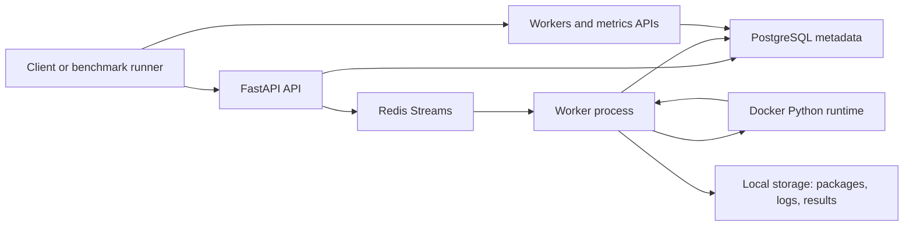

# Serverless Cloud Platform

A lightweight Lambda-style serverless platform for local development and systems
experiments. The project demonstrates function registration, immutable version
uploads, asynchronous invocation dispatch through Redis Streams, worker
heartbeats, Docker-based Python runtime execution, retry/recovery behavior,
metrics, logs, and benchmark evidence.

## What It Does

- Registers functions and uploads zipped Python handler packages.
- Creates immutable function versions with runtime limits and package hashes.
- Accepts async invocations through `POST /functions/{name}/invoke`.
- Publishes invocation work to Redis Streams.
- Executes user code in a Docker runtime from a worker process.
- Stores terminal invocation status, result, error, and logs.
- Recovers stale workers and reclaims pending Redis Stream messages.
- Exposes worker health and invocation metrics APIs.
- Provides local benchmark workloads and a reproducible benchmark report.

## Architecture



The platform is intentionally local-first. It is useful for demonstrating
serverless control-plane and worker-runtime concepts, not for production-grade
multi-tenant isolation.

## Repository Layout

```text
backend/       FastAPI gateway, schemas, services, database migrations
worker/        Worker loop, heartbeats, Redis consumer, recovery, Docker execution
runtime/       In-container Python runtime runner and runtime image
frontend/      React and TypeScript monitoring dashboard scaffold
infra/         Local infrastructure notes
scripts/       Demo and developer helper scripts
tests/         Unit and failure-injection tests
benchmarks/    Benchmark runner and workload functions
examples/      Example user functions
storage/       Local package, result, and log storage
docs/          Design notes, threat model, benchmark report
```

## Local Quick Start

Requirements:

- Docker Desktop or Docker Engine
- Python 3.11+
- Bash and curl

Start the full local platform:

```bash
cd "/Users/02/Documents/Serverless Cloud Platform"

docker compose up --build
```

This starts:

- PostgreSQL
- Redis
- FastAPI API on `http://localhost:8000`
- Worker process connected to Redis Streams

The compose setup uses `.env.example` for local defaults.

## Run the Demo Invocation

In a second terminal, run:

```bash
cd "/Users/02/Documents/Serverless Cloud Platform"

bash scripts/demo_invoke.sh
```

The script will:

- create a sample function
- build a `function.zip`
- upload a new version
- invoke the function
- poll until terminal status
- print the invocation response and logs

Expected terminal state is `SUCCEEDED`, with a result similar to:

```json
{"message":"hello Ada"}
```

## Useful API Calls

Create a function:

```bash
curl -fsS -X POST http://localhost:8000/functions \
  -H "Content-Type: application/json" \
  -d '{"name":"hello"}'
```

Invoke a function:

```bash
curl -fsS -X POST http://localhost:8000/functions/hello/invoke \
  -H "Content-Type: application/json" \
  -d '{"payload":{"name":"Ada"},"idempotency_key":"demo-hello"}'
```

Query an invocation:

```bash
curl -fsS http://localhost:8000/invocations/<invocation_id>
```

Query invocation logs:

```bash
curl -fsS http://localhost:8000/invocations/<invocation_id>/logs
```

Query workers and metrics:

```bash
curl -fsS http://localhost:8000/workers
curl -fsS http://localhost:8000/metrics/summary
```

## Benchmarks

Run a real local benchmark after `docker compose up --build` is running:

```bash
cd "/Users/02/Documents/Serverless Cloud Platform"

python3 benchmarks/run_benchmark.py \
  --workload noop \
  --invocations 20 \
  --concurrency 5
```

Latest recorded local result:

| Metric | Value |
| --- | --- |
| throughput_invocations_per_second | 4.76 |
| success_rate | 1.0 |
| error_rate | 0.0 |
| timeout_rate | 0.0 |
| p95_latency_ms | 1089.25 |
| average_queue_latency_ms | 641.17 |
| average_execution_latency_ms | 201.57 |

The full report is in `docs/benchmark-report.md`, and raw JSON is stored in
`benchmarks/results/latest.json`.

Additional workloads:

```bash
python3 benchmarks/run_benchmark.py --workload sleep \
  --payload '{"seconds":0.2}' \
  --invocations 20 \
  --concurrency 5

python3 benchmarks/run_benchmark.py --workload cpu_bound \
  --payload '{"n":250000}' \
  --invocations 20 \
  --concurrency 5

python3 benchmarks/run_benchmark.py --workload failing \
  --invocations 10 \
  --concurrency 2
```

## Recovery and Failure Injection

The worker uses Redis Streams consumer groups and supports pending message
reclaim with at-least-once execution semantics. If a worker crashes after
receiving a task but before ACK, a later worker can reclaim the pending message,
mark the stale worker offline, record the lost attempt, and continue processing.

Run the failure-injection regression:

```bash
cd "/Users/02/Documents/Serverless Cloud Platform"

python3 -m pytest tests/failure_injection/test_worker_crash_recovery.py
```

## Development Checks

Install local test dependencies:

```bash
cd "/Users/02/Documents/Serverless Cloud Platform"

python3 -m venv .venv
.venv/bin/python -m pip install -e ".[test]"
```

Run the test suite:

```bash
cd "/Users/02/Documents/Serverless Cloud Platform"

python3 -m compileall backend worker benchmarks tests
.venv/bin/python -m pytest
git diff --check
```

Current test coverage includes:

- API health and function registry behavior
- package upload and invocation creation
- Redis Streams producer/consumer parsing
- Docker runtime executor behavior
- worker heartbeat, retry policy, and stale worker recovery
- workers and metrics APIs
- benchmark runner calculations
- worker crash failure injection

## Current Limits

- Authentication is intentionally simplified for local development.
- Docker runtime isolation is not production-grade sandboxing.
- Autoscaling and Kubernetes scheduling are out of scope for this MVP.
- The React dashboard is scaffolded and is the next area to connect to APIs.
